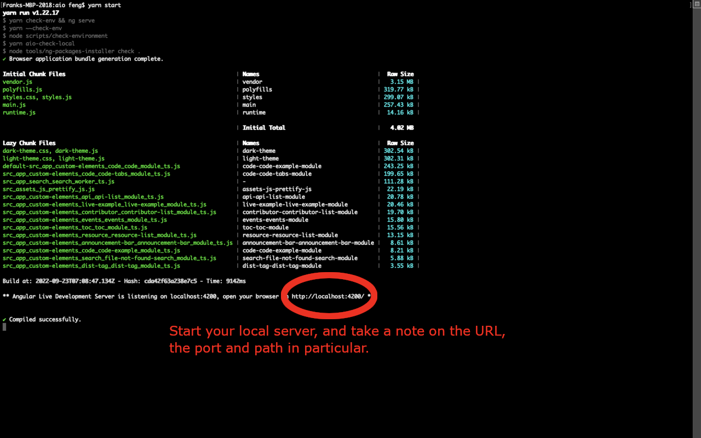
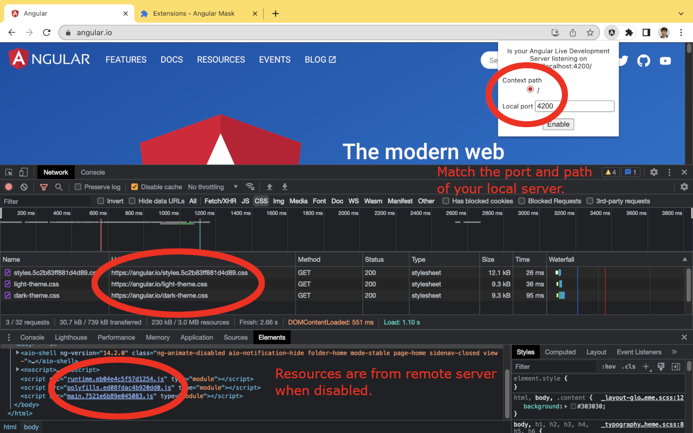
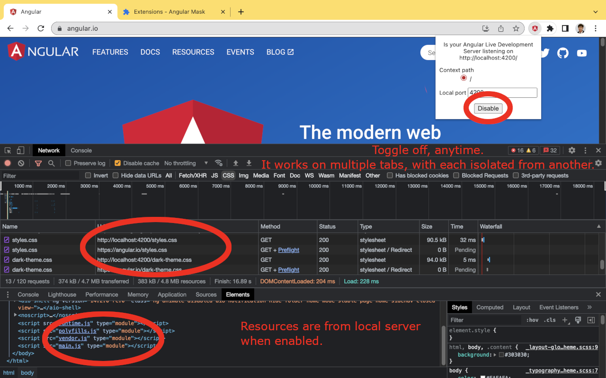

# Store listing

## Description

It enables you to

- Debug a remote web site, for which source map is usually disabled, with your local web server
- Test your local changes with actual data from remote servers - integration test before pull request

The idea and its implementation are based on HTTP and HTML web standards, independent to the framework of your choice, with the following constraints:

- It doesn't work with `document.write()`
- The local web server must include HTTP response header, Access-Control-Allow-Origin:\*
- "Bypass for network" for service workers. See screenshots for instruction.
- Web socket is not redirected, i.e. Hot module reload (hmr) or live reload doesn't work unless you can force their origin to localhost

It's similar to "Resource Override", but built for Manifest V3, and easy to integration into automated tests. See

- Resource Override, https://chrome.google.com/webstore/detail/resource-override/pkoacgokdfckfpndoffpifphamojphii
- Manifest V2 support timeline, https://developer.chrome.com/docs/extensions/develop/migrate/mv2-deprecation-timeline
- Test automation examples, https://github.com/renfeng/web-mask/tree/master/test/specs

Tests (in alphabetic order)

- An Angular website: https://material.angular.io/
  - Source code: https://github.com/angular/material.angular.io
  - Successful. Automated.
- A React website: https://reactjs.org/
  - Source code: https://github.com/reactjs/reactjs.org
  - Successful. Manual.
- A Vue.js website: https://vuejs.org/
  - Source code: https://github.com/vuejs/docs
  - Successful. Automated.

## Category

Developer Tools

## Language

English (United Kingdom)

## Store icon

## Screenshots

## Homepage URL

https://github.com/renfeng/web-mask

## Support URL

https://github.com/renfeng/web-mask

# Privacy practices

## Single Purpose Description

It overrides resources, JS, CSS, Image, and fonts, of a website with the copies from a local web server.

## declarativeNetRequestWithHostAccess justification

Redirect HTTP requests for javascript, css, image, ... files to local web server.

## webRequest justification

Wait for network idle, similar to https://pptr.dev/api/puppeteer.page.waitfornetworkidle/

## Host permission justification

Redirect HTTP requests for javascript, css, image, and font files to local web server.

## Are you using remote code?

No, I am not using remote code
