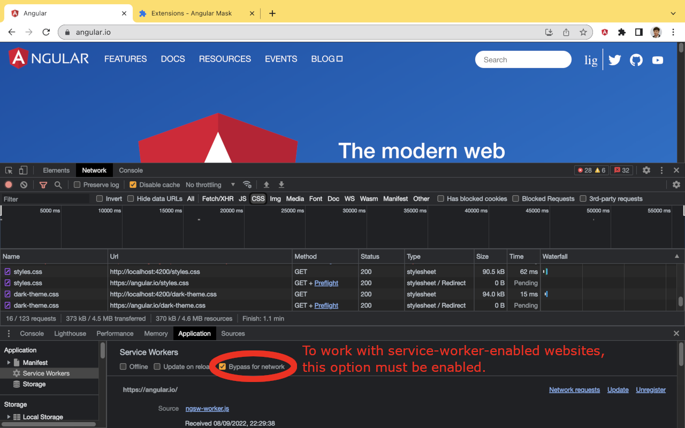

# Store listing

## Description

It overrides resources, JS, CSS, Image, and fonts, of a website with the copies from a local web server.

It enables you to

- Debug a remote web site, for which source map is usually disabled, with your local web server
- Test your local changes with actual data from remote servers - integration test before pull request

Tested with (in alphabetic order)
* https://angular.io/ - https://github.com/angular/angular
* https://reactjs.org/ - https://github.com/reactjs/reactjs.org
* https://vuejs.org/ - https://github.com/vuejs/docs

The idea and its implementation are based on HTTP and HTML. They are independent to the above frameworks, and work for all web technologies.

It's similar to "Resource Override", but requires a minimum configuration and is built for Manifest V3. See
* https://chrome.google.com/webstore/detail/resource-override/pkoacgokdfckfpndoffpifphamojphii
* https://developer.chrome.com/docs/extensions/mv3/mv2-sunset/

## Category

Developer Tools

## Language

English (United Kingdom)

## Store icon

## Screenshots

# Privacy practices

## Single Purpose Description

It overrides resources, JS, CSS, Image, and fonts, of a website with the copies from a local web server.

## declarativeNetRequestWithHostAccess justification

Redirect HTTP requests for javascript, css, image, ... files to local web server.

## storage justification

Manifest v3 "... service worker will ... get terminated repeatedly throughout a user's browser session ... treating the Storage APIs as our source of truth"
https://developer.chrome.com/docs/extensions/mv3/migrating_to_service_workers/#state

## Host permission justification

Redirect HTTP requests for javascript, css, image, ... files to local web server.

## Are you using remote code?

No, I am not using remote code
